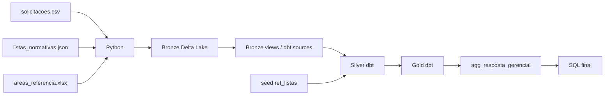

# FormalizaEnte — Data Pipeline V4 consolidado

PoC acadêmica de engenharia de dados construída para responder uma pergunta gerencial com um
número rastreável, testado e reproduzível. Esta V4 consolida os pontos mais fortes das três
implementações anteriores em uma única arquitetura coerente.

> **Dados:** todas as fontes desta entrega são sintéticas e não contêm dados pessoais reais.

## Pergunta de negócio

> **Qual é a taxa de cobertura das solicitações pelo FormalizaEnte, em qual esfera — Município,
> Estado ou União — elas são resolvidas e como essa cobertura varia por período, categoria e área
> de origem?**

As principais métricas derivadas, inexistentes nas fontes, são:

- **taxa de cobertura:** solicitações válidas encontradas em ao menos uma lista ÷ total de
  solicitações válidas;
- **taxa de ambiguidade:** solicitações encontradas em duas ou mais listas ÷ total de solicitações
  válidas;
- **distribuição por esfera:** participação de Município, Estado, União e Não encontrado.

## Arquitetura

Foi adotada a jornada **Raw → Bronze → Silver → Gold → Resposta**.



### O que cada camada faz

| Etapa | Implementação | Responsabilidade |
|---|---|---|
| Fontes | CSV + JSON + XLSX | dados sintéticos e defeitos intencionais |
| Ingestão | `src/pipeline.py` | leitura e persistência sem regra de negócio |
| Preservação | Delta Lake | bruto preservado; solicitações com 2+ versões |
| Linhagem Bronze | views DuckDB + `sources.yml` | Bronze aparece explicitamente na DAG do dbt |
| Silver | dbt + Parquet em `data/silver` | limpeza, tipagem, validação, deduplicação e quarentena |
| Regra versionada | `seeds/ref_listas.csv` | prioridade REMUME → RESME → RENAME |
| Gold | dbt + Parquet em `data/gold` | fato, dimensões e métricas derivadas por recorte |
| Resposta | `gold.agg_resposta_gerencial` | visão única orientada à pergunta |
| Consulta final | `queries/resposta_negocio.sql` | somente SELECT da Gold; zero regra de negócio |

## Fontes

A V4 usa **3 fontes em 3 formatos**:

1. `data/raw/solicitacoes.csv` — solicitações sintéticas em dois lotes;
2. `data/raw/listas_normativas.json` — amostra sintética de itens REMUME/RESME/RENAME;
3. `data/raw/areas_referencia.xlsx` — domínio organizacional de áreas.

Os defeitos intencionais estão documentados em `data/raw/DEFEITOS.md`.

## Critério de aceite

Em um clone limpo:

### Linux/macOS

```bash
python -m venv .venv
source .venv/bin/activate
python -m pip install -r requirements.txt
python -m src.pipeline
dbt build
```

### Windows PowerShell

```powershell
py -3.12 -m venv .venv
.\.venv\Scripts\Activate.ps1
python -m pip install -r requirements.txt
python -m src.pipeline
dbt build
```

O `dbt_project.yml` e o `profiles.yml` ficam na raiz, portanto o comando de aceite é literalmente
`dbt build`, sem `--project-dir` ou ajuste manual.

## Validação completa

```bash
python -m src.pipeline
dbt build
python -m pytest
ruff check src tests_python
dbt docs generate
python -m src.answer
python -m src.time_travel
```

Ou:

```bash
make all
```

## Por que a consulta final é segura para a avaliação

`queries/resposta_negocio.sql` não calcula taxa, não classifica esfera, não deduplica, não acessa
Raw/Bronze/Silver e não contém `WHERE` de regra de negócio. Toda a lógica está nos modelos dbt.

```sql
select
    tipo_recorte,
    recorte,
    total_solicitacoes,
    solicitacoes_atendidas,
    taxa_cobertura_pct,
    taxa_ambiguidade_pct,
    percentual_distribuicao_pct
from gold.agg_resposta_gerencial
order by ordem_exibicao, recorte;
```

## Delta Lake e time travel

`data/bronze/solicitacoes` é reconstruída em duas etapas:

- versão 0: primeiro lote;
- versão 1: segundo lote anexado.

```bash
python -m src.time_travel
```

O script executa **a mesma consulta** sobre a versão 0 e a versão atual.

## Linhagem

```bash
dbt docs generate
dbt docs serve
```

A DAG parte de `source:bronze`, passa por Staging/Intermediate e chega à Gold. A validação da área
vem da fonte XLSX e a prioridade das listas vem do seed versionado `ref_listas`.

## Testes

A entrega possui bem mais que os 8 testes mínimos e cobre, entre outros:

- `not_null`;
- `unique`;
- `accepted_values`;
- `relationships`;
- testes SQL singulares de reconciliação e consistência;
- testes Python de formatos, Delta, time travel, consulta final e reconciliação Bronze/Gold.

## Estrutura

```text
.
├── data/
│   ├── raw/                    # CSV + JSON + XLSX
│   ├── bronze/                 # Delta Lake e histórico
│   ├── silver/                 # Parquet tratado pelo dbt
│   └── gold/                   # Parquet analítico para consumo
├── src/                        # ingestão, resposta, limpeza e time travel
├── seeds/                      # regra versionada de prioridade das listas
├── models/
│   ├── staging/
│   ├── intermediate/
│   └── marts/
├── tests/                      # testes singulares dbt
├── tests_python/
├── queries/
├── analyses/
├── docs/evidence/
├── DECISOES.md
├── DADOS.md
├── RESULTADO.md
├── APRESENTACAO.md
└── CHANGELOG_V4.md
```

## Segurança e reprocessamento

- `data/raw` nunca é alterado pelo pipeline;
- `data/bronze`, `data/silver` e `data/gold` são camadas derivadas e reconstruíveis;
- os dados são sintéticos;
- não há secrets ou credenciais;
- registros inválidos são quarentenados, não apagados;
- o pipeline pode ser reconstruído do zero;
- somente caminhos derivados explicitamente autorizados podem ser removidos pelo script.

## Dashboard web (Streamlit)

Além do notebook exploratório, a entrega possui um dashboard web real em `app/dashboard.py`.
Ele consome somente a camada Gold e oferece filtros, KPIs, gráficos interativos, análise das
listas normativas, detalhamento e exportação CSV.

```powershell
python -m pip install -r requirements-dashboard.txt
python -m src.pipeline
dbt build
streamlit run app/dashboard.py
```

No Windows, depois de instalar as dependências, também é possível executar:

```powershell
.\run_dashboard.ps1
```
